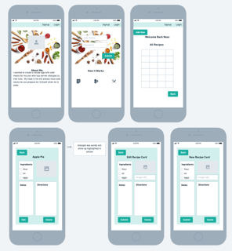

## Recipe App

#### Welcome to the Recipe App!

##### An app that users can contribute and read recipes and the recipes of others.  This app is especially useful for those with food allergies as the top allergens come up highlighted throughout the app.

### [Try out my app here!](https://tumeric-project-2.onrender.com)

#### Technologies Used
- JavaScript
- HTML
- CSS
- Express.js
- Node.js
- Mongo DB
- Mongoose
- 

#### Planning Materials

#### Link to Trello Board
[TRELLO BOARD](https://trello.com/invite/b/WzUc0MP5/ATTI5bd1b5243c4ed366025e8c14ff1635709A268B3A/tumeric-unit-2-project)

#### Wireframes

#### Credits

#### Ice Box
